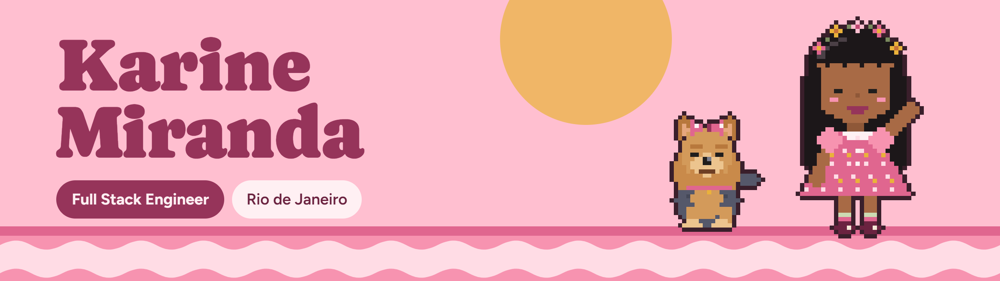
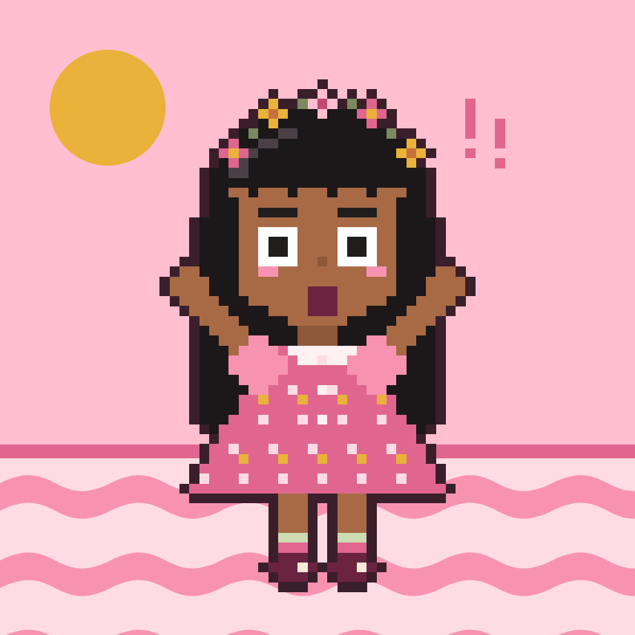

<div align="center">

[](https://portfolio-ten-phi-9wit0eooco.vercel.app/)
[](https://linkedin.com/in/karinems)
[](mailto:karinemsilva245@gmail.com)
[](https://github.com/km2s)

</div>


<table>
<tr>
<td width="180" valign="top"></td>
<td valign="top">

## Oi! I'm Karine

Full Stack Engineer straight from **Rio de Janeiro**, usually followed by **Manny**, my yorkshire and official code reviewer.

I build products end to end: well-architected backends, carefully crafted interfaces and AI where it actually helps.

**Computer Science** — IBMR · **Systems Analysis & Development** — Veiga de Almeida

</td>
</tr>
</table>

```ts
const karine = {
  role: "Full Stack Engineer",
  basedIn: "Rio de Janeiro, BR",
  sidekick: "Manny (yorkshire)",

  daily: ["Vue.js", "Vuetify", "TypeScript"],
  sideProjects: ["Next.js", "FastAPI", "PostgreSQL", "Spring Boot"],
  languages: ["TypeScript", "Python", "Java", "JavaScript"],
  ai: ["OpenAI", "Ollama", "OpenRouter"],

  learning: ["C/C++", "Flutter", "Data Science", "PyTorch"],
};
```


## Cardápio — featured projects

<table>
<tr>
<td width="50%" valign="top">

### 01 · [Saga RPG](https://saga-ruddy.vercel.app/)


Tabletop RPG campaign manager: character sheets for 5+ systems, virtual table with fog of war, real-time sync and a Discord bot.

`Next.js` `TypeScript` `PostgreSQL` `Prisma` `Supabase` `Discord.js`

</td>
<td width="50%" valign="top">

### 02 · [Marcou](https://marcou-mocha.vercel.app/)


Multi-tenant scheduling SaaS with 3-layer anti-double-booking — proven by a race-condition test.

`Java 21` `Spring Boot` `React 19` `PostgreSQL` `Testcontainers`

</td>
</tr>
<tr>
<td width="50%" valign="top">

### 03 · [Beauty Store](https://beauty-store-rose.vercel.app/)


AI-powered beauty e-commerce: recommendation quiz, MercadoPago payments, loyalty points and affiliate program.

`Next.js` `FastAPI` `Python` `PostgreSQL` `OpenAI`

</td>
<td width="50%" valign="top">

### 04 · [revctl](https://github.com/km2s/revctl)


Local AI code review in your terminal via Ollama — diff, commit or branch. No API key, no cloud.

`Python` `Ollama` `Typer` `Rich`

</td>
</tr>
<tr>
<td width="50%" valign="top">

### 05 · [repoaudit](https://github.com/km2s/repoaudit)


Health check CLI for Node/TS repos: outdated deps, circular imports, unused deps & exports, env vars.

`TypeScript` `Node.js` `ts-morph` `madge`

</td>
<td width="50%" valign="top">

### 06 · [VOID Bot](https://github.com/km2s/void-bot)


Modular Discord bot with an AI persona, music queue, gacha-style cards, community events and tickets.

`Node.js` `Discord.js` `OpenRouter` `Railway`

</td>
</tr>
</table>


## Postcards from the journey

| | |
|:--|:--|
| **2022** | Started Computer Science (IBMR) and Systems Analysis (Veiga de Almeida) — at the same time |
| **jun 2022** | Equinix — Young Apprentice |
| **2023** | First full stack projects: React, Node.js, PostgreSQL |
| **sep 2024** | Globo — Development Intern (until jul 2026) |
| **2026** | Shipped my own products: VOID Bot, Beauty Store, revctl, Saga RPG, Marcou |
| **aug 2026** | Hired by **Insi** |


## Toolbox

<p></p>
<p></p>
<p></p>


## Stats

<div align="center">


</div>

<div align="center">

### Bora construir algo juntos?

[karinemsilva245@gmail.com](mailto:karinemsilva245@gmail.com)

</div>


